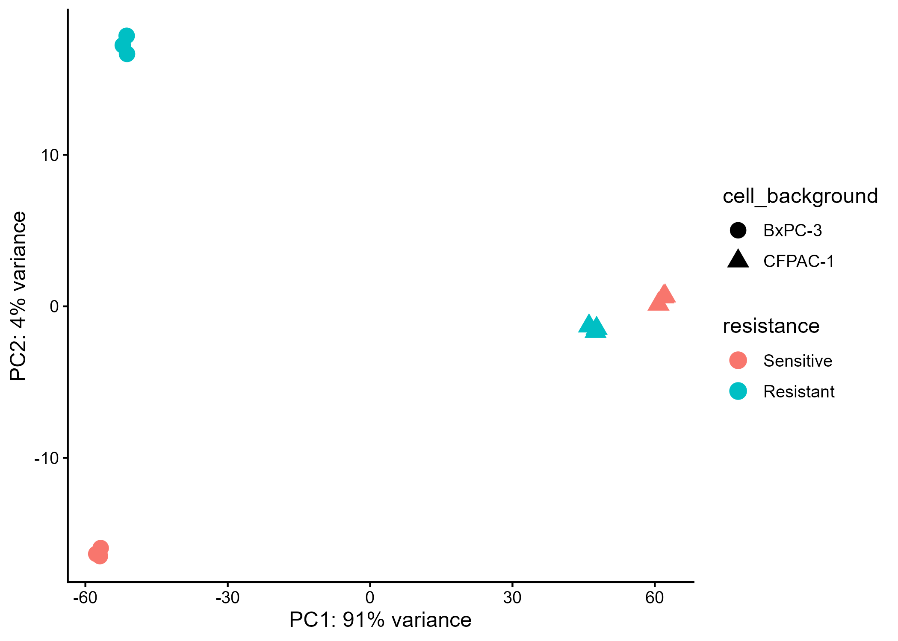
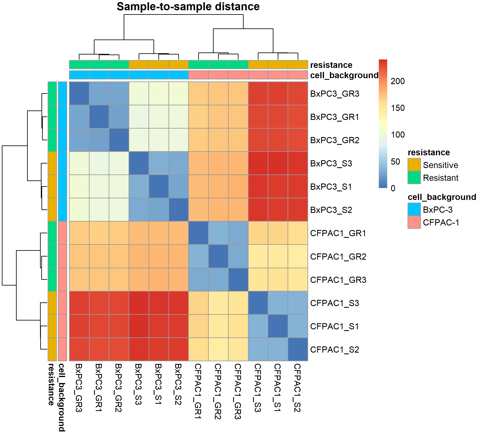
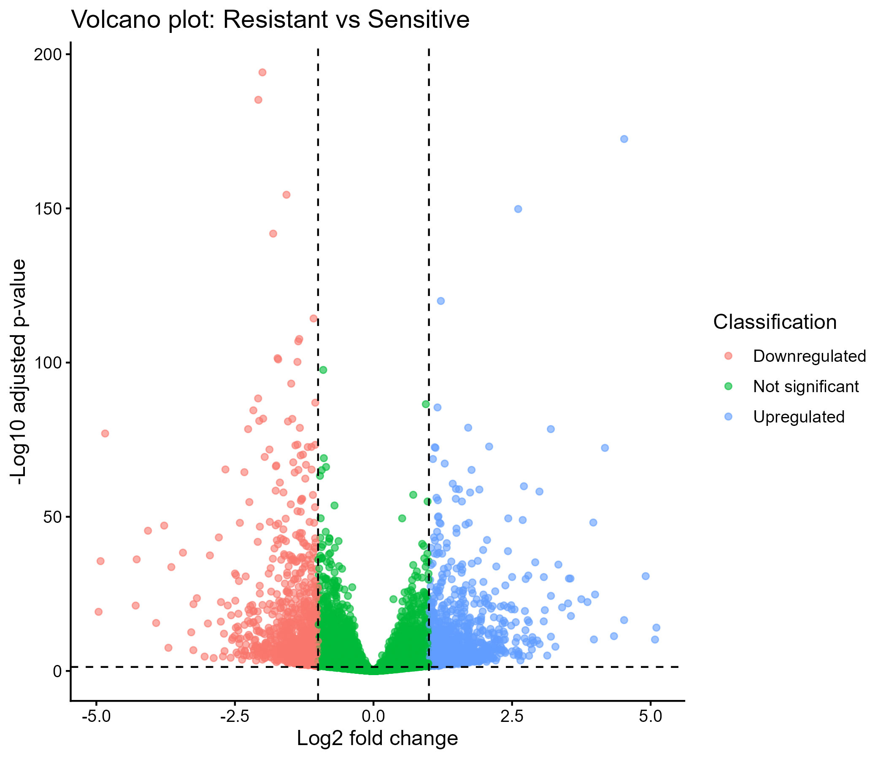
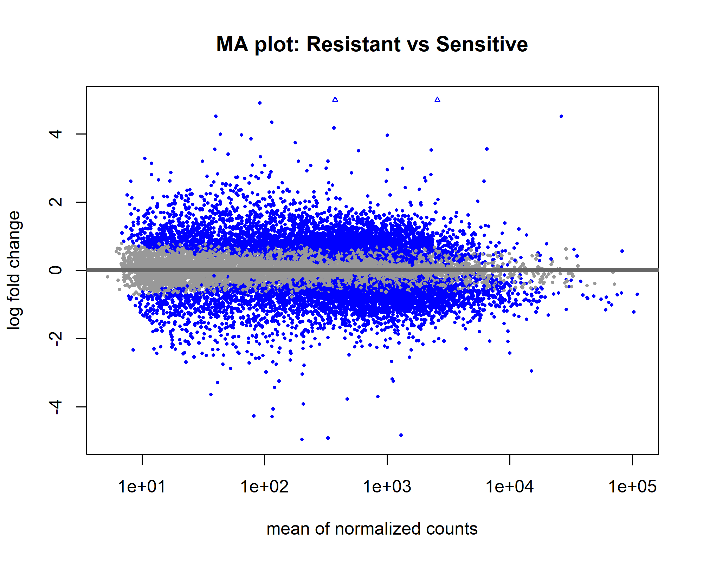
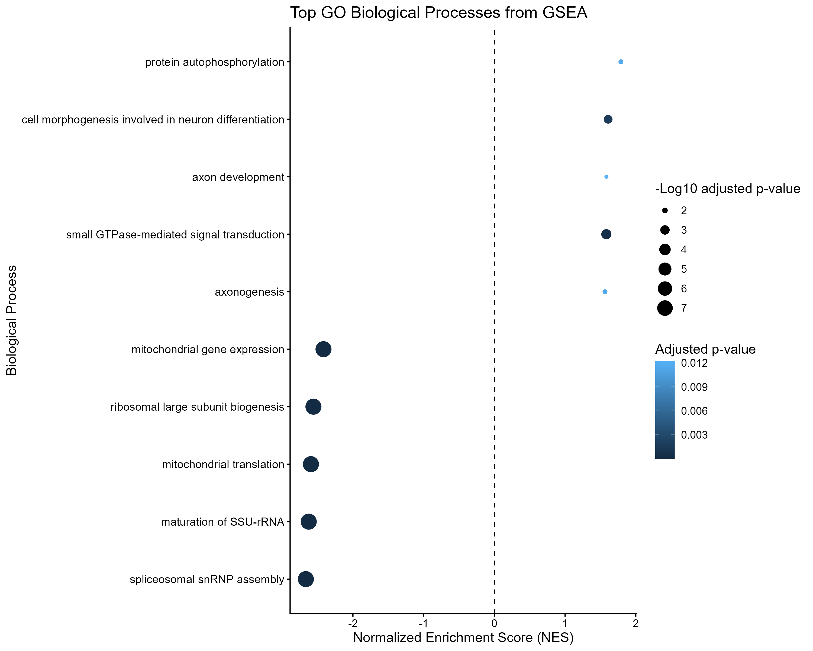
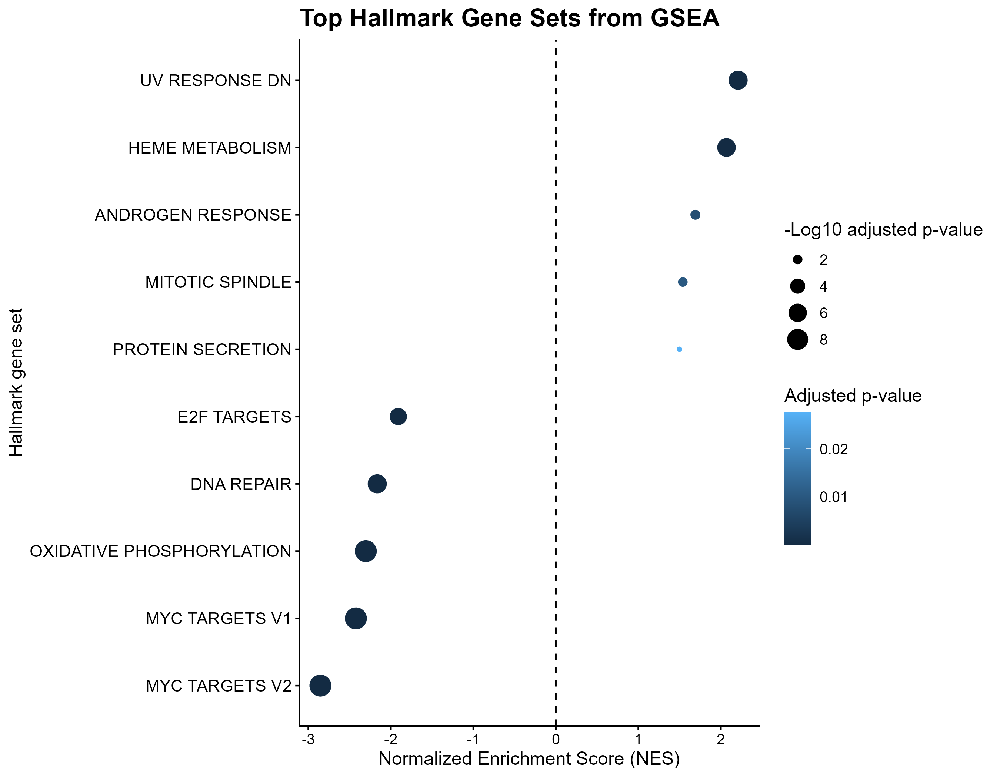

# RNA-seq Analysis of Gemcitabine Resistance in Pancreatic Cancer

Independent bulk RNA-seq reanalysis of human pancreatic cancer cell lines to identify transcriptional and pathway-level changes associated with acquired gemcitabine resistance.

## Key findings

DESeq2 retained **15,423 genes** after low-count filtering and identified **2,523 DEGs** using `padj < 0.05` and `|log2FC| > 1` (1,379 upregulated and 1,144 downregulated in Resistant vs Sensitive).

Pathway-level analysis showed a strong and coherent **negative enrichment** signal for ribosome biogenesis/RNA processing, mitochondrial gene expression, and oxidative phosphorylation. Hallmark GSEA also showed strong negative enrichment of **MYC target programs, oxidative phosphorylation, DNA repair, and E2F target programs** in the Resistant-associated expression profile.

Positive enrichment was observed for signaling, cytoskeletal, cell-adhesion, and several regulatory Hallmark gene sets. These findings describe coordinated expression-level associations in the two cell-line models and should not be interpreted as evidence of direct causality.

## Project overview

This project reanalyzes the public GEO dataset **GSE140077**, which contains transcriptome profiles from two human pancreatic cancer cell lines and their gemcitabine-resistant derivatives. The study includes four experimental conditions with three biological replicates per condition (12 samples total).

The main analysis asks:

> Which transcriptional changes are associated with gemcitabine resistance after accounting for the underlying cell-line background?

The primary statistical model is:

`~ cell_background + resistance`

This separates the resistance-associated effect from the strong baseline expression differences between the two cell backgrounds.

## Dataset

- **GEO:** [GSE140077](https://www.ncbi.nlm.nih.gov/geo/query/acc.cgi?acc=GSE140077)
- **BioProject:** PRJNA588180
- **Organism:** *Homo sapiens*
- **Experiment:** bulk RNA-seq
- **Samples:** 12
- **Conditions:**
  - BxPC-3 Sensitive (n=3)
  - BxPC-3-GR Resistant (n=3)
  - CFPAC-1 Sensitive (n=3)
  - CFPAC-1-GR Resistant (n=3)
- **Original publication:** Zhou et al., *Cancer Medicine* (2020), DOI: [10.1002/cam4.2764](https://doi.org/10.1002/cam4.2764)

The original study established gemcitabine-resistant derivatives of BxPC-3 and CFPAC-1 and characterized their transcriptomic profiles. This repository contains an **independent reanalysis** of the public sequencing data rather than a reproduction of the original computational pipeline.

## Analysis workflow

```text
Public ENA FASTQ data
      |
      v
FastQC / MultiQC
      |
      v
Adapter and quality trimming
(Trimmomatic)
      |
      v
FastQC / MultiQC
      |
      v
Splice-aware alignment
(HISAT2)
      |
      v
BAM sorting and indexing
(Samtools)
      |
      v
Gene-level quantification
(featureCounts)
      |
      v
DESeq2 differential expression
      |
      +---- PCA
      +---- Sample-distance heatmap
      +---- MA plot
      +---- Volcano plot
      |
      v
Pathway analysis
      +---- GO / KEGG over-representation analysis
      +---- GO GSEA
      +---- KEGG GSEA
      +---- Hallmark GSEA
      +---- Leading-edge analysis
```

## Key methods

### Quality control and preprocessing

Raw paired-end FASTQ files were downloaded directly from the **European Nucleotide Archive (ENA)** using the corresponding SRA run accessions. No SRA archive files were used in the final processing workflow. FASTQ files were evaluated with FastQC and summarized with MultiQC. Adapter and quality trimming was performed with Trimmomatic, and surviving paired reads were used for downstream alignment.

### Alignment

Reads were aligned to the human GRCh38 reference genome using HISAT2 with paired-end reverse-stranded RNA-seq settings. BAM files were sorted and indexed with Samtools.

### Quantification

Gene-level counts were generated with featureCounts using the GENCODE v50 annotation and reverse-stranded paired-end settings. Read pairs were counted as fragments/templates.

### Differential expression

DESeq2 was used with the design:

```text
~ cell_background + resistance
```

The primary contrast is:

```text
Resistant vs Sensitive
```

Low-count genes were filtered by requiring at least 10 counts in at least the smallest resistance group. Log2 fold changes were shrunk using `apeglm`.

### Functional analysis

Gene-level results were analyzed using:

- Gene Ontology (GO) Biological Process enrichment
- KEGG over-representation analysis
- GO GSEA
- KEGG GSEA
- MSigDB Hallmark GSEA
- Leading-edge gene extraction for selected enriched gene sets

GSEA rankings were based on the DESeq2 Wald statistic and therefore used the full ranked gene list rather than only statistically significant DEGs.

## Main results

The DESeq2 analysis retained **15,423 genes** after low-count filtering.

Using `padj < 0.05` and `|log2FC| > 1`:

- **2,523 DEGs**
- **1,379 upregulated** in Resistant
- **1,144 downregulated** in Resistant

An additional **8,115 genes** had `padj < 0.05` without imposing the fold-change threshold.

### Over-representation analysis

GO and KEGG over-representation analysis were performed on the combined DEG set using the DESeq2-tested genes with valid Entrez IDs as the background. The current analysis produced **no GO terms or KEGG pathways passing FDR < 0.05**.

There were **2,327 mapped DEG Entrez IDs** used for enrichment and **14,137 mapped background Entrez IDs**. The difference from the 2,523 DEGs and 15,423 retained genes reflects ID mapping/annotation availability.

The repository does not report separate downregulated-only ORA findings because that analysis was not part of the current pipeline.

### GSEA

GSEA revealed stronger pathway-level structure when the full ranked gene list was used. The ranking contained **14,137 genes with valid Entrez IDs**.

Strong negative enrichment was observed for themes including:

- ribosome biogenesis and rRNA processing
- RNA splicing / spliceosome-related processes
- mitochondrial gene expression and translation
- oxidative phosphorylation and ATP production
- nucleotide biosynthesis

Positive enrichment included signaling, cytoskeletal, cell-adhesion, and related regulatory processes.

GO GSEA initially returned 742 significant terms; semantic simplification reduced this to 269 terms. Among the simplified terms, **10** were significantly enriched in the positive direction and **39** in the negative direction at `FDR < 0.05`.

### KEGG GSEA

KEGG GSEA identified **67 significant pathways** in the current output. Strong negative enrichment included spliceosome, ribosome biogenesis, ribosome, oxidative phosphorylation, and related cellular machinery. Positive enrichment included signaling and cancer-related regulatory pathways such as sphingolipid signaling and FoxO signaling.

### Hallmark GSEA

The Hallmark collection provided a compact complementary view of pathway-level changes. Significant negative enrichment included:

- MYC target programs
- oxidative phosphorylation
- DNA repair
- E2F target programs
- unfolded protein response
- xenobiotic metabolism
- epithelial-mesenchymal transition
- p53 pathway
- G2/M checkpoint

Significant positive enrichment included heme metabolism, mitotic spindle, protein secretion, and other regulatory gene sets.

### Selected GSEA results

| Gene set / pathway | NES | Adjusted p-value |
|---|---:|---:|
| Hallmark MYC Targets V2 | -2.84 | 1.67e-09 |
| KEGG Spliceosome | -2.43 | 1.17e-08 |
| Hallmark Oxidative Phosphorylation | -2.32 | 1.67e-09 |
| KEGG Oxidative Phosphorylation | -2.34 | 8.66e-08 |

These represent selected examples of strong enrichment signals rather than an exhaustive ranking.

## Selected figures

### Experimental structure and differential expression

#### PCA



#### Sample-to-sample distance



#### Volcano plot



#### MA plot



### Pathway-level analysis

#### GO GSEA summary



#### Hallmark GSEA summary



Detailed enrichment plots for selected gene sets are available in [`figures/gsea_enrichment_plots/`](figures/gsea_enrichment_plots/).

## Repository structure

```text
rnaseq-drug-resistance-analysis/
|
├── README.md
├── scripts/
│   ├── prepare_metadata.sh
│   ├── prepare_count_matrix.sh
│   ├── qc_raw.sh
│   ├── multiqc_raw.sh
│   ├── trim_reads.sh
│   ├── qc_trimmed.sh
│   ├── multiqc_trimmed.sh
│   ├── align_hisat2.sh
│   ├── multiqc_mapping.sh
│   ├── featurecounts.sh
│   └── deseq2_analysis.R
│
├── data/
│   ├── metadata/
│   ├── fastq/             # ignored from Git
│   └── reference/         # ignored from Git
│
├── results/
│   └── deseq2/            # selected derived results
│
├── figures/
└── environment/
```

Large raw sequencing files, trimmed FASTQ files, BAM files, genome FASTA files, and HISAT2 index files are excluded from GitHub through `.gitignore`.

## Reproducibility

### Command-line environment

The micromamba environment used for the main RNA-seq workflow is documented in [`environment/environment.yml`](environment/environment.yml). Key tool versions include:

- FastQC 0.12.1
- SRA Toolkit 3.4.1
- Trimmomatic 0.41
- MultiQC 1.35
- HISAT2 2.2.3
- Samtools 1.24
- featureCounts/Subread 2.1.1

The separate R analysis environment is documented through the package-loading section in `scripts/deseq2_analysis.R` and can be further captured with `sessionInfo()` when the analysis is rerun.

The main DESeq2 script expects to be run from the project root:

```r
rm(list = ls())
source("scripts/deseq2_analysis.R")
```

Reference resources used in the analysis include GRCh38 and GENCODE v50. The prebuilt HISAT2 index is also GRCh38, but its underlying Ensembl release differs from the GENCODE annotation release; this provenance difference is documented rather than hidden.

## Interpretation and limitations

This analysis uses established pancreatic cancer cell lines and resistant derivatives, so the results describe transcriptional differences between these experimental cell models. They should not be assumed to represent all pancreatic tumors or all mechanisms of gemcitabine resistance.

The project focuses on association rather than causation. Pathway enrichment indicates coordinated expression patterns and does not by itself demonstrate that a pathway causes resistance.

Several GO and KEGG gene sets overlap substantially. GO results were therefore semantically simplified before presentation, and related Hallmark gene sets such as MYC Targets V1/V2 are treated as a single biological theme rather than independent findings.

## Reference

Zhou J, Zhang L, Zheng H, et al. Identification of chemoresistance-related mRNAs based on gemcitabine-resistant pancreatic cancer cell lines. *Cancer Medicine*. 2020;9(3):1115-1130. DOI: https://doi.org/10.1002/cam4.2764

Dataset source: NCBI GEO GSE140077.
